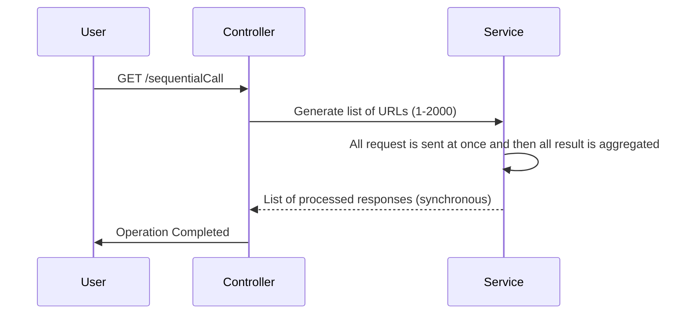
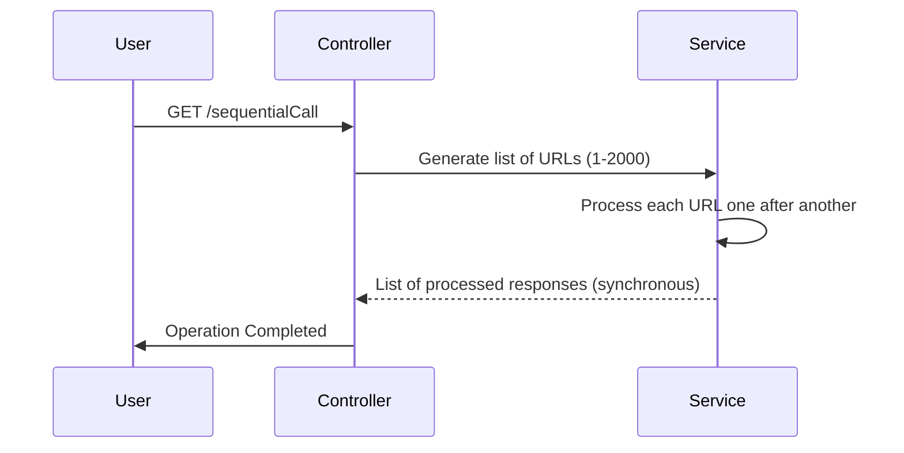
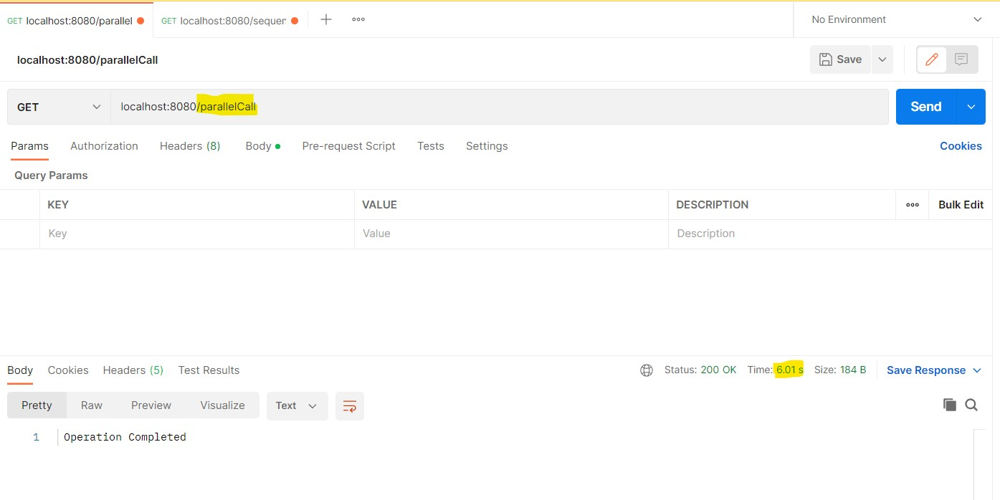
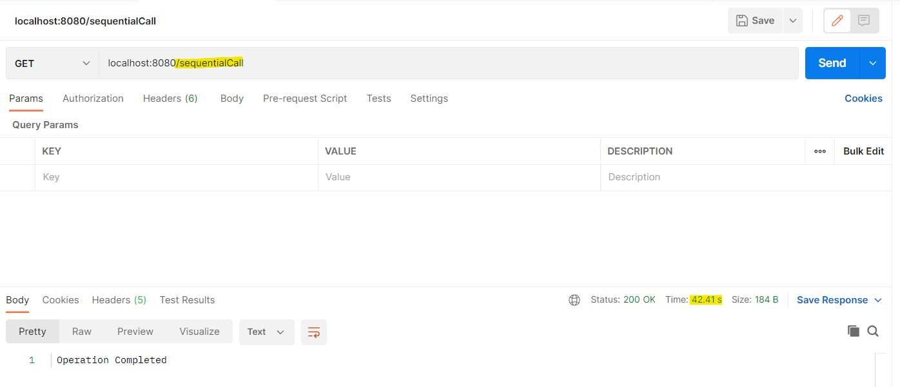

# Spring-Boot-Parallel-API-Call
Making Parallel API calls using WebClient (Spring WebFlux: Framework for reactive web applications)

## Overview
This project demonstrates how to make parallel API calls using Spring Boot with WebFlux. It covers both parallel and sequential API calls, highlighting their differences and benefits. Built for reactive programming, this project utilizes Spring WebFlux to handle high-load scenarios efficiently.

## Features
- Perform parallel and sequential API calls.
- Built using Spring WebFlux for reactive programming.
- Efficient handling and processing of multiple API responses.
- Demonstrates architectural flow with a clear separation of concerns.

## Endpoints
Below are the key REST API endpoints exposed by the application:
- **`GET /api/parallel`**: Performs API calls in parallel and returns combined responses.
- **`GET /api/sequential`**: Performs API calls sequentially and returns combined responses.

## Technology Stack
- Spring Boot
- Spring WebFlux
- Java 17
- Maven
- H2 Database (as an optional feature if persistence is involved)

## Architecture Flow
The application follows an event-driven, non-blocking architecture. Key components include:
- **Controller**: Handles incoming requests and routes them to appropriate services.
- **Service**: Implements business logic for making parallel/sequential API calls.
- **WebClient**: Asynchronous non-blocking HTTP client for API calls.

### Sequential Call Workflow

## Parallel vs Sequential Calls
- **Parallel Calls**:
  - All API calls are fired simultaneously using non-blocking methods.
  - Faster as all responses are processed as they are received.
- **Sequential Calls**:
  - API calls are made one at a time in a synchronous flow.
  - Slower because each request waits for the previous to complete.

## Performance Results with 2000 calls

This project is an excellent reference for understanding reactive programming and efficient API communication using Spring WebFlux.
